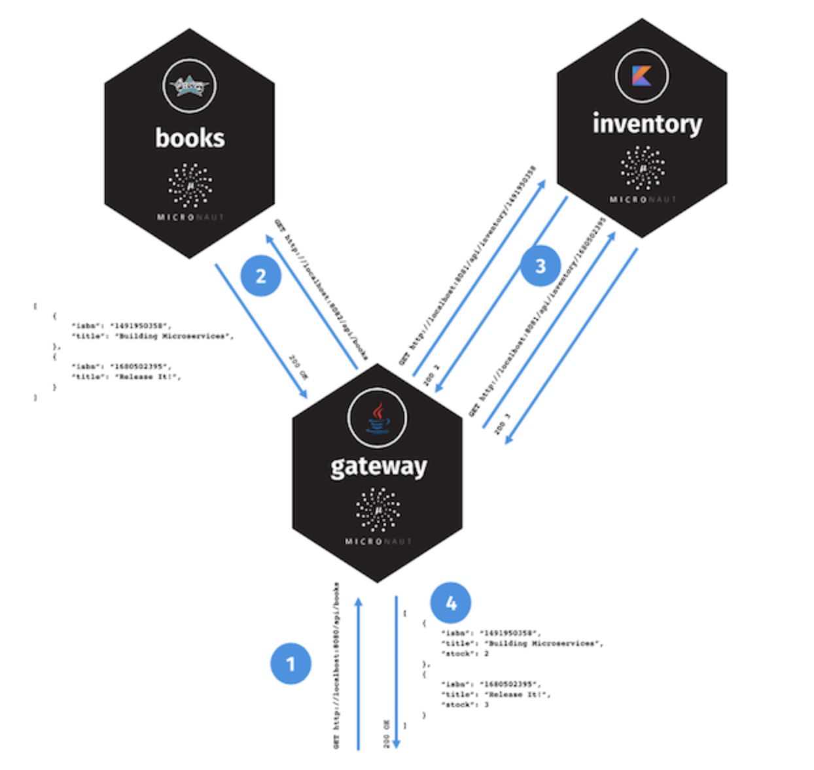

一个 books 微服务，使用 Groovy 编写；
一个 inventory 微服务，使用 Kotlin 编写；
一个 gateway 微服务，使用 Java 编写。

Consul 启动
./consul agent -dev           # -dev表示开发模式运行，另外还有-server表示服务模式运行

查看consul cluster中的每一个consul节点的信息
./consul members

Consul控制台
http://127.0.0.1:8500/ui/

分别执行quickstart-books、quickstart-gateway、quickstart-inventory中的Application启动类
再次去Consul控制台查看注册信息情况

quickstart-inventory项目访问不了，不知道为什么

分别访问
http://localhost:8080/hello/John
http://localhost:8081/hello/John
http://localhost:8082/hello/John

curl http://localhost:8080/api/books

代码示例参考
https://www.infoq.cn/article/micronaut-tutorial-microservices-jvm
https://github.com/micronaut-projects/micronaut-examples
https://docs.micronaut.io/latest/guide/index.html

